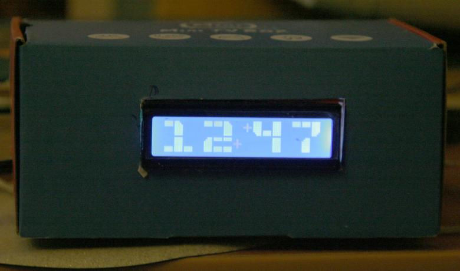
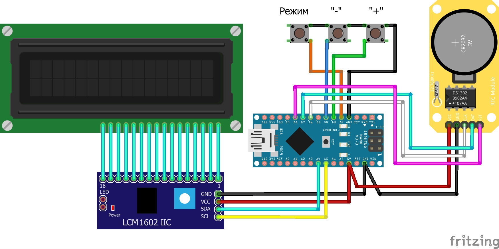

## clock_lcd_1602 - часы на LCD1602 с крупными цифрами

Очень древний, практически самый первый мой проект, про который я уже давно забыл, но внезапно всплыл вопрос по нему, поэтому решил его окультурить и опубликовать.

- [Описание](#описание)
- [Использованные библиотеки](#использованные-библиотеки)

### Описание

Часы построены на **Arduino Nano/UNO/Pro Mini/** на **Atmega328**, но при необходимости скетч поместится даже в **Atmega8/88** без загрузчика. В качестве экрана используется LCD экран 1602, подключаемый по **I2C**. В часах используется модуль RTC **DS1302**.

Часы управляются тремя кнопками, позволяют настраивать часы, минуты и секунды. Календаря нет. 

Схема подключения - в виде той еще картинки, нарисованной в далеком ковидном 2020 году, рисовать нормальную схему лень ))

При желании разобраться можно ))

### Использованные библиотеки

Скетч не дорабатывал, выкладываю в том виде, в каком он уже четыре года лежит у меня на компе. Ссылки на использованные библиотеки ниже, работоспособность с ними проверил:

**shButton** - https://github.com/VAleSh-Soft/shButton

**ArduinoRTClibrary** - https://github.com/chrisfryer78/ArduinoRTClibrary/tree/master

**LiquidCrystal_I2C** - https://github.com/johnrickman/LiquidCrystal_I2C

Если возникнут вопросы, пишите на valesh-soft@yandex.ru 